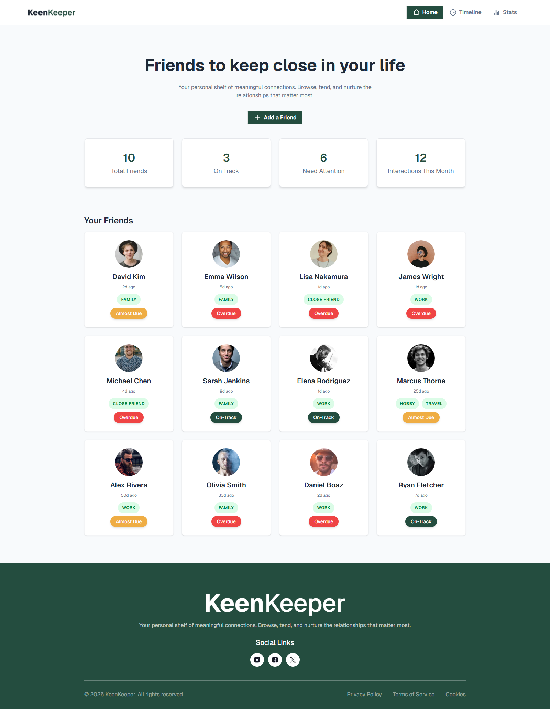

# 🚀 Keen Keeper

This is an assignment (#7) project of MERN stack course in programming hero batch 13.

Keen Keeper is a streamlined social activity tracker designed to help users maintain and monitor their digital interactions. Built for the modern social connector, it logs every "ping"—be it a call, text, or video chat—into a clean, searchable timeline, providing visual insights into social habits through interactive data analytics.

Live on Netlify - https://keen-keeper-six-inky.vercel.app/
 
 

## 🛠️ Technology Stack

<strong>Framework:</strong> Next.js 16 (App Router) 
<strong>Library:</strong> React 19 
<strong>Styling:</strong> Tailwind CSS v4 & DaisyUI 
<strong>State Management:</strong> React Context API, Local Storage 
<strong>Charts:</strong> Recharts (PieChart) 
<strong>Notifications:</strong> React-Toastify 
<strong>Icons:</strong> React Icons  

## ✨ Key Features

1. <strong>Real-Time Interaction Logging</strong> 
   Trigger instant social actions (Call, Text, Video) through an intuitive UI. Each action uses React-Toastify for immediate feedback and is automatically saved to the global activity state with precise timestamps and metadata via the Context API. 
2. <strong>Advanced Activity Timeline</strong> 
   A robust history feed that allows users to revisit their interactions. It features:
   Multi-Criteria Filtering: View interactions by type (Text, Call, Video) or sort chronologically (Newest/Oldest).
   Smart Search: Instantly find specific events by searching for a friend's name or the interaction type.
   Optimized Performance: Uses useMemo and useTransition for lag-free filtering even as data grows. 
3. <strong>Data-Driven Social Insights</strong> 
   Visualise your social footprint on the Statistics page. The integration of Recharts PieCharts provides a breakdown of your interaction types, allowing you to see at a glance whether you're a "texter" or a "caller."  

## 🛠️ How to Run Locally

<strong>Clone the repository:</strong> 
git clone https://github.com/ZunaidChowdhury/keen-keeper.git 

<strong>Install dependencies:</strong> 
npm install 

<strong>Run the development server:</strong> 
npm run dev 

<strong>Open in browser:</strong> 
Navigate to http://localhost:3000  

## 📸 Screenshot - Desktop Version

  

<h1 align="center">
Keen Keeper — Stay keen on your connections.  
</h1>
